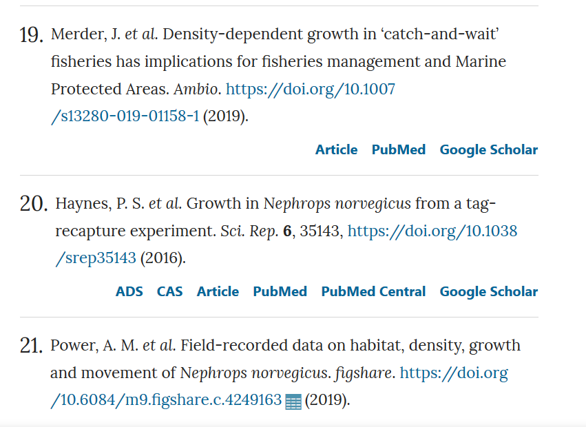
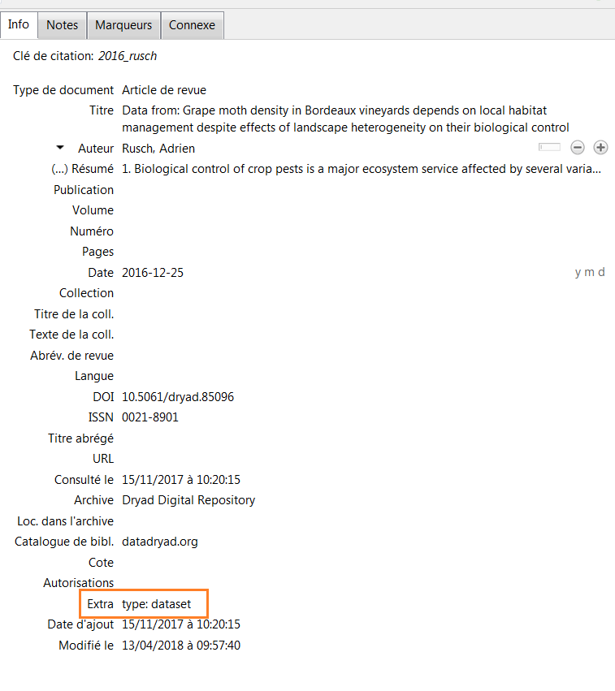
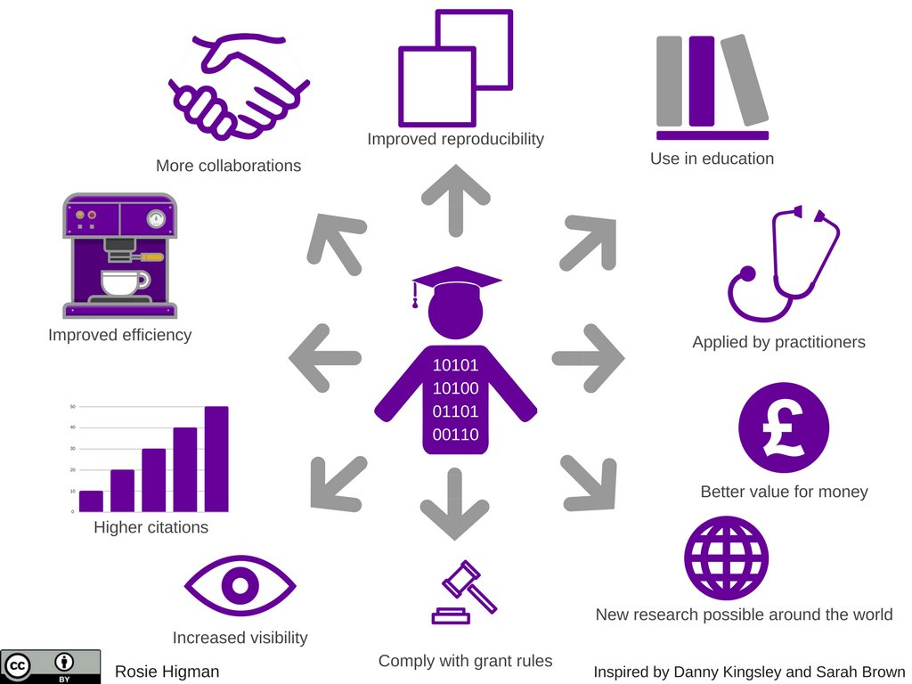

# Zenodo, Figshare, etc.: rechercher et partager des données de recherche grâce aux entrepôts de données

## Sommaire

<!-- MDTOC maxdepth:1 firsth1:0 numbering:0 flatten:0 bullets:1 updateOnSave:1 -->

- [Sommaire](#sommaire)   
- [0. Que sont pour vous les "données de recherche" et comment les partagez-vous?](#0-que-sont-pour-vous-les-données-de-recherche-et-comment-les-partagez-vous)   
- [1. Identifier et choisir des entrepôts de données pertinents](#1-identifier-et-choisir-des-entrepôts-de-données-pertinents)   
- [2. Trouver des jeux de données existants](#2-trouver-des-jeux-de-données-existants)   
- [3. Citer les jeux de données](#3-citer-les-jeux-de-données)   
- [4. Déposer des données dans la base test de Zenodo, Zenodo sandbox](#4-déposer-des-données-dans-la-base-test-de-zenodo-zenodo-sandbox)   
- [5. Conclusion](#5-conclusion)   

<!-- /MDTOC -->

## 0. Que sont pour vous les "données de recherche" et comment les partagez-vous?

 Nous prenons quelques minutes pour préparer ce tour de table.

Pouvez-vous réfléchir à propos du dernier article que vous avez lu/écrit : quel était le matériel supplémentaire (tableaux, figures, etc.)?

Pouvez-vous noter des **exemples** et des types de données de recherche pertinents pour votre domaine de recherche?

Quels **modes de partage** des fichiers de données sont-ils utilisés dans votre domaine?

🔇 Si vous n'avez pas de micro ou ne souhaitez pas prendre la parole, répondez dans la conversation Zoom.

### Modes de partage des données de recherche

| Méthode       | Avantage     | Inconvénient     |
| :------------- | :---------- | ----------- |
|  Publier les données sur un **site web** (d'un projet, d'un laboratoire, etc.) | Les données sont facilement accessibles pour les autres    DIssémination plus large de la recherche  | Requiert une maintenance de la part du groupe de recherche    Pas de contrôle sur qui accède aux données    Incapacité à attribuer un DOI ou un autre identifiant pérenne au jeu de données   |
| Soumettre les données à une **revue** ou publier un **article de données** ou _data paper_ 	| Les données sont associées à l'article publié au sujet de ces données    Les données sont partagées avec les pairs | Les données peuvent ne pas donner lieu à un article mais devoir quand même être partagées    En fonction de la revue, l'accès peut être restreint aux chercheurs bénéficiant d'un abonnement à la revue|
| Répondre aux **demandes** de données 	| Conserver le contrôle sur qui utilise les données 	| Accès très limité aux données    Peut ne pas être une méthode acceptable pour les agences de financement    Peut être chronophage	|
| Déposer les données dans un **entrepôt de données** | En fonction des entrepôts, accès paramétrable : fermé >> restreint >> sous embargo >> ouvert    Ne requiert aucune maintenance par le groupe de recherche    Capacité à attribuer un DOI ou un autre identifiant pérenne au jeu de données    Les données sont partagées avec les pairs | Les limitations peuvent varier en fonction des entrepôts : soumission limitée à certains utilisateurs, soumission payante, nécessité de respecter un format de données et/ou de métadonnées, etc. |

Adapté de : Llebot, C. Research Data Services : Sharing Your Data. _Oregon State University Libraries_. Repéré à https://guides.library.oregonstate.edu/research-data-services/data-sharing

## 1. Identifier et choisir des entrepôts de données pertinents

### Terminologie

#### Données de recherche
> **Data**
>
> Data in the sense used here are all digitally available objects (simple or complex) that emerge or are the result of the research process.

_On entend ici par données tous les objets (simples ou complexes) disponibles sous forme numérique qui émergent ou sont le résultat du processus de recherche._

#### Entrepôt de données

> **Repository**
>
> Repository is defined as the infrastructure and corresponding service that allows for the persistent, efficient and sustainable storage of digital objects (such as documents, data and code).

_Un entrepôt est défini comme l'infrastructure et le service correspondant qui permet le stockage persistant, fiable et durable des objets numériques (tels que les documents, les données et le code)._

Ces deux définitions sont tirées du [glossaire](https://book.fosteropenscience.eu/en/06Glossary/) du livre suivant :

Bezjak, S. et al. (2018). _Open Science Training Handbook_. Hannover : FOSTER Plus Consortium. Repéré à https://book.fosteropenscience.eu/

### Quelle démarche pour identifier un entrepôt de données approprié?

 En fonction du contexte, les étapes suivantes pourront être combinées selon un ordre différent.

#### Suivre les pratiques de votre communauté
Privilégier un entrepôt spécialisé pour votre discipline, ou l'entrepôt généraliste utilisé par votre communauté.

#### Suivre les recommandations ou obligations

Ces recommandations ou ces obligations peuvent émaner de différentes parties prenantes.

* D'un financeur : [ERC - European Research Council](https://erc.europa.eu/sites/default/files/document/file/ERC_info_document-Open_Research_Data_and_Data_Management_Plans.pdf), [Fonds national suisse pour la recherche scientifique](http://www.snf.ch/SiteCollectionDocuments/FAIR_data_repositories_examples.pdf)
* D'un éditeur : [PLoS](https://journals.plos.org/plosone/s/data-availability#loc-recommended-repositories), [Springer-Nature](https://www.springernature.com/gp/authors/research-data-policy/repositories/12327124)

#### Identifier les critères importants pour vous et les hiérarchiser

Voici quelques exemples de critère qui peuvent être pris en compte.

* L'entrepôt est-il **certifié**?

En savoir plus sur la certification _CoreTrustSeal_ :

RDA France. (2019). Entrepôts de données de confiance : Critères de conformité. Repéré à https://www.rd-alliance.org/system/files/documents/CoretrustsealFR.pdf

* L'entrepôt gère-t-il différents **types d'accès**? Permet-il par exemple un accès restreint ou sous **embargo**?

* L'entrepôt prend-il en charge un **format de données** particulier?

* Quelles sont les exigences ou possibilités en termes de **précision et structuration de la description des données déposées**? Devrez-vous ou pourrez-vous fournir des métadonnées riches? Voici quelques exemples de jeux de données, de la description la plus sommaire à la plus complète et la plus structurée.

**> Exemple 1a : dépôt dans [Open Science Framework](https://osf.io) - données liées à un article**

Reynolds, N., & Green, C. (2019). Spatiotemporal modelling of radiocarbon dates using linear regression does not indicate a vector of demic dispersal associated with the earliest Gravettian assemblages in Europe [Data set]. _Open Science Framework_. https://doi.org/10.17605/OSF.IO/6XRTS

:point_right: Il s'agit des données liées à l'article suivant :

Reynolds, N., & Green, C. (2019). Spatiotemporal modelling of radiocarbon dates using linear regression does not indicate a vector of demic dispersal associated with the earliest Gravettian assemblages in Europe. _Journal of Archaeological Science: Reports_, _27_, 101958. https://doi.org/10.1016/j.jasrep.2019.101958

Depuis la page de cet article sur ScienceDirect, pouvez-vous accéder à ces données dans OSF? Comment?

**> Exemple 1b : dépôt dans [Zenodo](https://zenodo.org) - données en accès restreint**

Krause, T. (2018). Corpora used in the benchmarks of the PhD thesis « ANNIS : A graph-based query system for deeply annotated text corpora » [Data set]. _Zenodo_. https://doi.org/10.5281/zenodo.1161383

**> Exemple 2 : dépôt dans [4TU.Centre for Research Data](https://data.4tu.nl/repository/)**

Plomp, E., Von Holstein, I., Koornneef, J., & Davies, G. (2019). Neodymium and strontium isotope analysis of modern human dental enamel using Thermal Ionization Mass Spectrometry (TIMS) [Data set]. _4TU.Centre for Research Data_. https://doi.org/10.4121/uuid:d541a402-2701-47b2-ac6a-eaaa14c8c111

**> Exemple 3 : dépôt dans [ACEAS Data Portal](http://aceas.tern.org.au/knb/) (ACEAS = Australian Centre for Ecological Analysis and Synthesis)**

Haberle, S. et al. (2014). Weekly pollen count data for for the University of Tasmania, Hobart [Data set]. _ACEAS_. https://doi.org/10.4227/05/5344E9A41A124

##### Ressources complémentaires

DoRANum. (2018). Du choix de l’entrepôt au dépôt des données. _DoRANum_. Repéré à https://doranum.fr/depot-entrepots/choix-entrepot-depot-donnees/

_Cette infographie interactive guide la démarche de choix d'un entrepôt en regroupant les critères en trois sous-ensembles de caractéristiques, celles liées **aux données**, **au partage** et **à l'entrepôt**._

Whyte, A. (2016). _Where to keep research data_ (Rapport No. v. 1.1). Edinburgh : Digital Curation Centre. Repéré à http://www.dcc.ac.uk/resources/how-guides-checklists/where-keep-research-data/where-keep-research-data#3

_Pour chacune des questions, le guide définit 3 niveaux de capacité de service. Il met en avant également des points à considérer pour chacune des questions._

> The checklist that follows addresses the five key questions posed in this guide:
> 1. is the repository reputable?
> 2. will it take the data you want to deposit?
> 3.  will it be safe in legal terms?
> 4.  will the repository sustain the data value?
> 5.   will it support analysis and track data usage?

#### Trouver un entrepôt de données avec re3data

Registry of Research Data Repositories. https://doi.org/10.17616/R3D // citation simplifiée : re3data - https://www.re3data.org/

Il s'agit de la ressource de référence, indexant plus de 2000 entrepôts.

On peut naviguer dans re3data par :
* [sujet](https://www.re3data.org/browse/by-subject/),
* [type de contenu](https://www.re3data.org/browse/by-content-type/),
* [pays](https://www.re3data.org/browse/by-country/).

 [Afficher la liste complète des entrepôts référencés dans re3data](https://www.re3data.org/search?query=)

De nombreux filtres permettent ensuite d'affiner les listes de résultats, en fonction par exemple des critères suivants.

* **Certificates** : par quelle certification l'entrepôt est-il qualifié?
* **Accès** : gradient de valeurs de fermé à ouvert - se décompose en 3 types d'accès :
  *  **Database access** : accès à l'entrepôt de données lui-même : sous quelles conditions un utilisateur peut-il accéder à la base de données en général?
  * **Data access** : accès aux jeux de données déposés dans un entrepôt de données spécifique : sous quelles conditions un utilisateur peut-il accéder à un jeu de données?
  * **Data upload** : accès à la soumission de données : sous quelles conditions un utilisateur peut-il soumettre des données ?
* **Versioning** : les jeux de données peuvent-ils être versionnés?

 Nous prenons quelques minutes  pour la recherche suivante.

En filtrant la recherche sur les entrepôts intégrant la fonctionnalité d'**attribution de DOI**, trouvez-vous un entrepôt spécialisé dans votre domaine?

Si vous ne trouvez pas d'entrepôt ou préférez vous concentrer sur des entrepôts généralistes, consultez les fiches de **Zenodo** et **B2SHARE**. Utiliseriez-vous ces services? Pourquoi?

🔇 Si vous n'avez pas de micro ou ne souhaitez pas prendre la parole, répondez dans la conversation Zoom.

### Outils complémentaires

Des services d'aide au choix et à la décision ont été développés, principalement à partir des données de re3data, et proposent des fonctionnalités supplémentaires.

**[FAIRsharing.org](https://fairsharing.org/)** :  répertorie non seulement des entrepôts mais également des standards, des méthodes, des vocabulaires, etc. Pour chaque ressource sont notamment spécifiés les critères suivants.
* Le **statut** : en développement / opérationnel / incertain / déprécié
* La **recommandation** : nom de l'éditeur, de la revue, etc. qui recommande

En savoir plus concernant FAIRsharing :

Sansone, S.-A. et al. (2019). FAIRsharing as a community approach to standards, repositories and policies. _Nature Biotechnology_, _37_(4), 358‑367. https://doi.org/10.1038/s41587-019-0080-8

**[Data Repository Finder (univ. Utrecht)](https://tools.uu.nl/repository-decision-tool/)** se présente sous la forme d'un formulaire web. En fonction de la réponse "Oui" ou "Pas nécessairement" apportée par l'utilisateur aux 4 questions suivantes, les entrepôts proposés restent affichés ou deviennent grisés. Une brève fiche descriptive est associée à chaque entrepôt de données.

* **Questions**
  * Are you looking for a repository managed by Utrecht University?
  * Will you publish data under access restriction?
  * Are you looking for a repository with the option to deposit for free?
  * Do you wish to have the freedom to choose your own data usage licence?

* **Entrepôts de données généralistes utilisés par ce service**
  * [4TU.ResearchData](https://data.4tu.nl/)
  * [(DANS) EASY](https://easy.dans.knaw.nl/ui/home)
  * [DataverseNL](https://dataverse.nl/)
  * [Dryad](http://www.datadryad.org/)
  * [Mendeley Data](https://data.mendeley.com/)
  * [Open Science Framework (OSF)](https://osf.io/)
  * [Yoda](https://public.yoda.uu.nl/) (entrepôt de données institutionnel de l'univ. d'Utrecht)
  * [Zenodo](https://zenodo.org/).

**[Data Deposit Recommendation Service](https://ddrs-dev.dariah.eu/ddrs/)** : ce service est développé par [l'infrastructure DARIAH](https://www.dariah.eu/) et spécialisé pour les **sciences humaines**. Il utilise les données de re3data. 2 critères peuvent être spécifiés:

* le pays - > choisir _European Union_ pour obtenir des réponses satisfaisantes,
* la discipline.

Pour certains entrepôts, il est possible de soumettre une demande de dépôt à partir de la fiche de cet entrepôt, par exemple [CLARIN-ERIC](https://ddrs-dev.dariah.eu/ddrs/selectRepository?id=100010209).

**[Repository Finder (DataCite)](https://repositoryfinder.datacite.org/)** : ce service est développé dans le cadre du [projet Enabling FAIR Data](http://www.copdess.org/enabling-fair-data-project/), porté par la _Coalition for Publishing Data in the Earth and Space Sciences_. Il permet d'identifier un entrepôt référencé dans re3data ou parmi les 208 entrepôts sélectionnés par le projet.

Ce service diffère des 2 précédents dans la mesure où on ne spécifie pas de critères de choix.

## 2. Trouver des jeux de données existants

 Comment procédez-vous actuellement pour chercher des donnés existantes?

### Interroger directement un entrepôt de données

Il s'agit de l'une des approches possibles : interroger directement un entrepôt disciplinaire de son domaine de recherche, ce qui peut permettre de bénéficier de fonctionnalités de recherche spécifiques.

Cela rejoint les astuces 2, 4 et 8 des 11 astuces recensées ci-dessous.

Gregory, K. et al. (2018). Eleven quick tips for finding research data. _PLOS Computational Biology_, _14_(4), e1006038. https://doi.org/10.1371/journal.pcbi.1006038

> Tip 1: Think about the data you need and why you need them.
>
> Tip 2: Select the most appropriate resource.
>
> Tip 3: Construct your query strategically.
>
> Tip 4: Make the repository work for you.
>
> Tip 5: Refine your search.
>
> Tip 6: Assess data relevance and fitness -for -use.
>
> Tip 7: Save your search and data- source details.
>
> Tip 8: Look for data services, not just data.
>
> Tip 9: Monitor the latest data.
>
> Tip 10: Treat sensitive data responsibly.
>
> Tip 11: Give back (cite and share data).

### Trouver des jeux de données en lien avec les publications

En plus du _data availability statement_ (parfois non accessible sans abonnement à la revue), des outils intégrés aux bases de données bibliographiques sont disponibles.

Dans le nouveau **[PubMed](https://www.ncbi.nlm.nih.gov/pubmed/?otool=ifruvsblib)**, il s'agit de l'attribut _Associated data_, disponible sous la forme d'un filtre à partir d'une liste de résultats.

Dans **[Scopus](http://docelec.u-bordeaux.fr/login?url=http://www.scopus.com)**, il s'agit de l'encart _Related Research Data_, accessible depuis la notice d'un article en particulier. Cette fonctionnalité est donc très limitée, puisqu'elle ne permet pas de sélectionner un ensemble d'articles ayant des données associées.

Le **type de publication** peut également être exploité comme critère de recherche ou de filtre. Il permet en effet d'identifier les articles de données, ou _data papers_. Les valeurs associées diffèrent en fonction des bases de données.
* Scopus -> choisir la valeur _data paper_
* PubMed -> choisir la valeur _dataset_

###  Les moteurs de recherche spécialisés

Le principal moteur de recherche spécialisé est [DataCite Search](https://search.datacite.org).

ℹ️ Vous trouverez une présentation détaillée de DataCite et d'autres moteurs spécialisés dans le support de la formation [_Data sharing_ : trouver, réutiliser et citer des données de recherche ](https://github.com/fflamerie/ED_datasharing/blob/master/content/ED_datasharing_COURS.md) (formation du Collège des écoles doctorales de l'université de Bordeaux).

 Nous prenons quelques minutes pour la recherche suivante.

En utilisant Datacite Search, identifiez un jeu de données qui vous semble pertinent.

Une fois ce jeu de données identifié, considérez les points suivants.

* Pensez-vous que ce jeu de données puisse vous être utile? Pourquoi?
* Les **métadonnées** sont-elles suffisantes? La **documentation** (fichier README, etc.) vous paraît-elle suffisante?
* Qu'en est-il de la licence de publication? Les conditions de **réutilisation** sont-elles claires?
* Sauriez-vous comment **citer** ce jeu de données?

## 3. Citer les jeux de données

### Où les données sont-elles citées?

De plus en plus d'éditeurs incitent les auteurs à citer les jeux de données au même titre que les articles dans leur bibliographie, dans une rubrique dédiée ou dans la bibliographie principale.

Voir par exemple pour une politique d'éditeur :

STM Publishing News. (2017, 14 septembre). Wiley announces new Data Sharing and Citation policies to improve transparency in research. _STM Publishing News_. Repéré à http://www.stm-publishing.com/wiley-announces-new-data-sharing-and-citation-policies-to-improve-transparency-in-research/

La politique de citation des données dans _Scientific Data_ est détaillée dans cet éditorial :

Data citation needed. (2019). _Scientific Data_, _6_(1), 27. https://doi.org/10.1038/s41597-019-0026-5

Exemple de données citées dans la bibliographie principale, référence n° 21 :

Power, A. M. et al. (2019). Field-recorded data on habitat, density, growth and movement of Nephrops norvegicus. _Scientific Data_, _6_(1), 7. https://doi.org/10.1038/s41597-019-0013-x

### Comment citer un jeu de données?

#### Avec un logiciel de gestion bibliographique, Zotero

* Enregistrer les jeux de données sous le type de document "Article de revue"
* Spécifier : `type: dataset` dans le champ `Extra`

* Choisir un style bibliographique qui prend en charge le type de document "Dataset", par exemple [APA](http://owl.english.purdue.edu/owl/resource/560/01/) ou Vancouver

#### Avec l'outil Citation Formatter fourni par DataCite

Ce service en ligne est accessible à l'adresse : https://citation.crosscite.org/

A partir d'un DOI et du choix d'un style bibliographique et de la langue, il génère automatiquement une citation correctement mise en forme.

## 4. Déposer des données dans la base test de Zenodo, Zenodo sandbox

 Nous prenons **15 minutes** pour cette activité.

Le dépôt dans Zenodo est très simple et rapide, peu de champs sont obligatoires.

Il est de plus possible de se familiariser avec l'interface et ses fonctionnalités grâce à une base de teste, le bac à sable accessible à l'adresse suivante : https://sandbox.zenodo.org/

Etapes :
* Créez-vous un compte ou identifiez-vous avec votre compte GitHub ou votre compte ORCID.
* Utilisez l'un des jeux de données identifié au cours de l'atelier (lors du tour de table, de la recherche d'entrepôt ou de la recherche de jeu de données) et déposez-le.

## 5. Conclusion

Reprenons la conclusion de l'article

Gregory, K. et al. (2018). Eleven quick tips for finding research data. _PLOS Computational Biology_, _14_(4), e1006038. https://doi.org/10.1371/journal.pcbi.1006038

> Regardless of whether you are acting as a data seeker or a data creator, remember that ‘data discovery and reuse are most easily accomplished when: (1) data are logically and clearly organized; (2) data quality is assured; (3) data are preserved and discoverable via an open data repository; (4) data are accompanied by comprehensive metadata; (5) algorithms and code used to create data products are readily available; (6) data products can be uniquely identified and associated with specific data originator(s); and (7) the data originator(s) or data repository have provided recommendations for citation of the data product(s)’

### Les enjeux en image

Source : Higman, R. (2017). Talking carrots and sticks for RDM at the #datastewards networking day, sharing the graphic on reasons to share we use in @UoMRDMService trainingpic.twitter.com/bMsj6h57RG [Tweet]. _@RosieHLib_. Repéré à https://twitter.com/RosieHLib/status/936587668607160320

### La grande image de la science ouverte

Source : Bezjak, S. et al. (2018). _Open Science Training Handbook_. Hannover : FOSTER Plus Consortium. Repéré à https://book.fosteropenscience.eu/

# Crédits

 Ce document est mis à disposition selon les termes de la <a rel="license" href="http://creativecommons.org/licenses/by-sa/3.0/fr/">Licence Creative Commons Attribution -  Partage dans les Mêmes Conditions 3.0 France</a>.

**Auteur**

Frédérique Flamerie

 [orcid.org/0000-0001-6014-0134](https://orcid.org/0000-0001-6014-0134)

**Visuels et icônes**

Bezjak, S. et al. (2018). _Open Science Training Handbook_. Hannover : FOSTER Plus Consortium. Repéré à https://book.fosteropenscience.eu/ - [CC-Zero]
